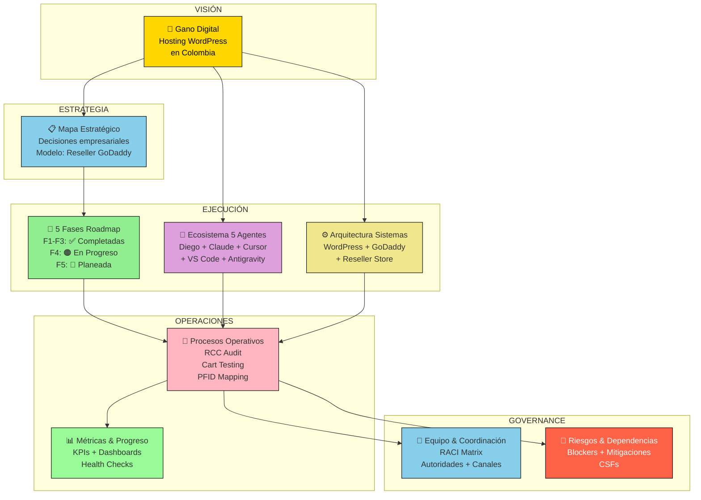
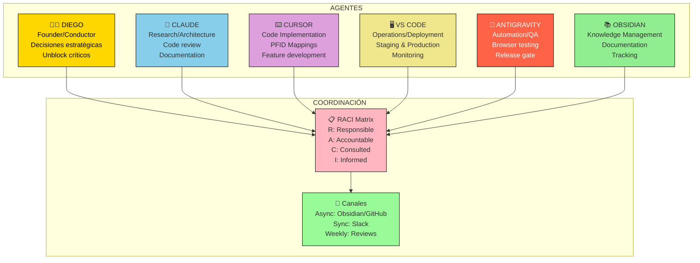
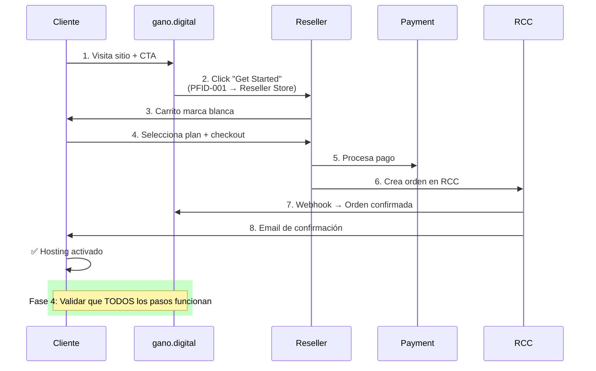
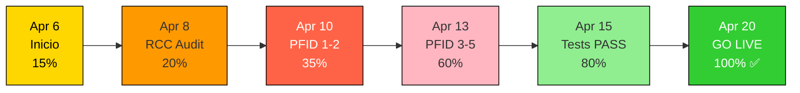
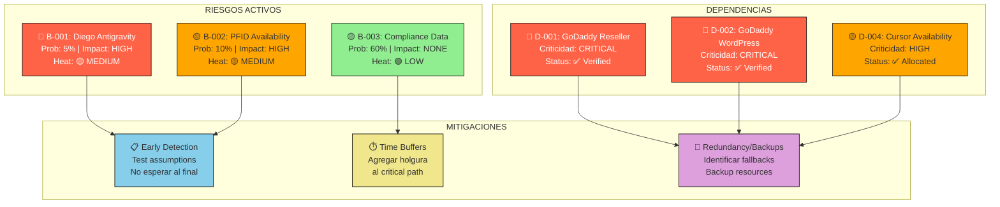
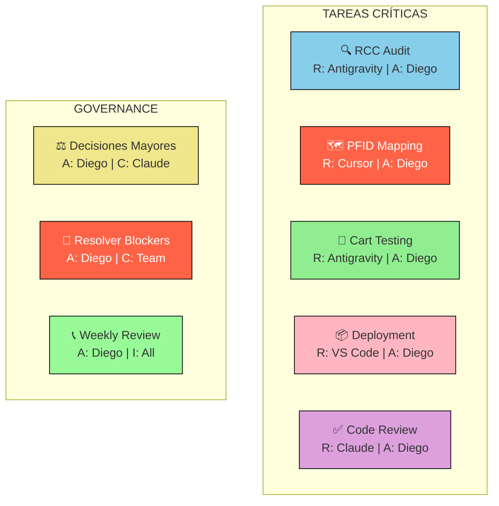

# 🌌 MAPA VISUAL INTERACTIVO — Gano Digital Constelación

**Última actualización**: 2026-04-06
**Tipo**: Visualización interactiva con Mermaid diagrams
**Propósito**: Navegación visual, relaciones de componentes, estado en tiempo real

---

## 🗺️ DIAGRAMA 1: Arquitectura General del Proyecto



---

## 🔄 DIAGRAMA 2: Ciclo de Desarrollo Phase 4 (Crítico)

```mermaid
graph LR
    Start["🟢 Inicio: Diego activa<br/>Antigravity"]
    RCCAudit["📋 Step 1: RCC Audit<br/>Identificar gaps"]
    PFIDMapping["🗺️ Step 2: PFID Mapping<br/>5 PFIDs requeridas"]
    StagingTest["🧪 Step 3: Testing Staging<br/>9/9 PASS = ready"]
    ProdTest["🚀 Step 4: Testing Prod<br/>Validación final"]
    GoLive["🎉 Step 5: GO LIVE<br/>Apr 20, 2026"]

    Start --> RCCAudit
    RCCAudit --> PFIDMapping
    PFIDMapping --> StagingTest
    StagingTest --> ProdTest
    ProdTest --> GoLive

    style Start fill:#FFD700,stroke:#000,color:#000
    style RCCAudit fill:#87CEEB,stroke:#000
    style PFIDMapping fill:#FF6347,stroke:#000,color:#fff
    style StagingTest fill:#90EE90,stroke:#000
    style ProdTest fill:#FFB6C1,stroke:#000
    style GoLive fill:#32CD32,stroke:#000,color:#fff
```



---

## 👥 DIAGRAMA 3: Ecosistema de 5 Agentes & Responsabilidades



---

## 🏗️ DIAGRAMA 4: Flujo Técnico — Orden de Cliente (Reseller Store)



---

## 📊 DIAGRAMA 5: Estado de Progreso Phase 4 (Burn-down)



---

## ⚠️ DIAGRAMA 6: Matriz de Riesgos (Probabilidad vs Impacto)



---

## 🎯 DIAGRAMA 7: RACI Matrix (Quién Hace Qué)



---

## 📈 DIAGRAMA 8: Métricas Clave Phase 4

```mermaid
gauge title PFID Mapping (0/5 = 0%)
    0 "0%"
    100 "100%"
    data --> 0

gauge title Test Pass Rate (Staging: N/A)
    0 "0%"
    100 "100%"
    data --> 0

gauge title Production Readiness (0%)
    0 "0%"
    100 "100%"
    data --> 0
```

---

## 🔗 NAVEGACIÓN RÁPIDA

### 📚 Leer en este orden:
1. **Este documento** (MAPA-VISUAL-INTERACTIVO) — visualización rápida
2. [[01-MAPA-ESTRATEGICO]] — visión + decisiones
3. [[02-FASES-ROADMAP]] — timeline + milestones
4. [[03-ECOSISTEMA-AGENTES]] — agentes + responsabilidades
5. [[04-ARQUITECTURA-SISTEMAS]] — tech stack + infraestructura
6. [[05-PROCESOS-OPERATIVOS]] — workflows + ciclos
7. [[06-METRICAS-PROGRESO]] — dashboards + KPIs
8. [[07-EQUIPO-COORDINACION]] — RACI + comunicación
9. [[08-DEPENDENCIAS-RIESGOS]] — riesgos + mitigaciones

---

## 🎬 ACCIONES INMEDIATAS (Próximos 7 días)

| Acción | Responsable | Deadline | Critical? |
|--------|-------------|----------|-----------|
| Activar Antigravity | Diego | Apr 7 EOD | 🔴 YES |
| RCC Audit | Antigravity | Apr 8 | 🔴 YES |
| Validar PFIDs en RCC | Cursor | Apr 8-9 | 🟡 MAYBE |
| Mapear PFID-001 & 002 | Cursor | Apr 10 | 🔴 YES |
| Desplegar a staging | VS Code | Apr 10 | 🔴 YES |
| Test staging (9/9) | Antigravity | Apr 13 | 🔴 YES |

---

## 💡 TIPS DE USO

✅ **En Obsidian**:
- Usa **Ctrl+Click** en links [[documento]] para abrir en nueva pestaña
- Abre **Graph View** (Ctrl+G) para ver relaciones visuales entre notas
- Usa **search** (Ctrl+P) para saltar rápido entre documentos
- Ve a **Backlinks** para ver qué otros documentos referencia este

✅ **Para presentación a team**:
- Comparte este documento (MAPA-VISUAL-INTERACTIVO) como intro
- Luego profundiza en documentos específicos según preguntas
- Usa diagramas Mermaid para explicar flujos

✅ **Para tracking**:
- Actualiza "% complete" en cada diagrama semanalmente
- Revisa matriz de riesgos cada viernes
- Consulta "Acciones Inmediatas" para próximos pasos

---

**Última actualización**: 2026-04-06
**Mantenido por**: Claude + Diego
**Próxima revisión**: Viernes 5 PM (semanal)
