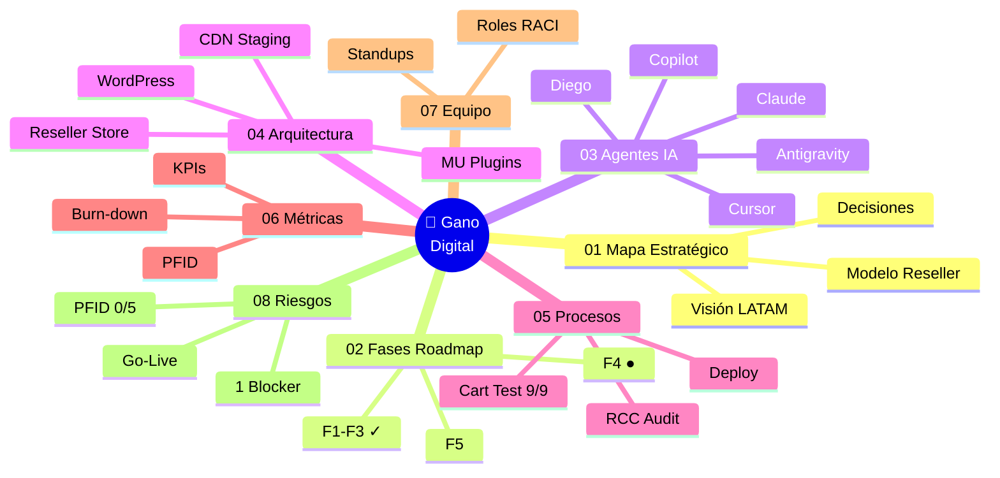

# 🌌 Constelación Cósmica · Gano Digital

> **Cosmic Map v2.0** — Visualización 3D interactiva del ecosistema completo del proyecto.
> Inspirada en astronomía real: starfield, nebulosa, fresnel, bloom, órbitas vivas.

---

## 🚀 Abrir el visualizador

> [!tip] Click para lanzar la experiencia completa
> 📂 **[[CONSTELACION-COSMICA.html|🌌 ABRIR CONSTELACIÓN CÓSMICA →]]**
>
> Se abre en tu navegador en pantalla completa. WebGL + Three.js + shaders custom.

**Ruta directa**: `memory/constellation/CONSTELACION-COSMICA.html`

**Contexto repo + contenido:** [`../content/digital-files-and-content-setup.md`](../content/digital-files-and-content-setup.md)

---

## 🎨 Qué vas a ver

| Elemento | Descripción técnica |
|---|---|
| ☀️ **Sol central** | Núcleo "Gano Digital" con shader fresnel + corona aditiva pulsante |
| 🪐 **8 planetas** | Los 8 sistemas de la constelación, cada uno con su color y órbita |
| 🛰️ **Satélites** | Sub-componentes (fases, agentes, KPIs) orbitando cada planeta |
| ✨ **8000 estrellas** | Starfield con shader de twinkle individual (fase + color únicos) |
| 🌫️ **Nebulosa** | Background con FBM noise procedural — capas violeta/cyan/magenta |
| ⚡ **Líneas de flujo** | Conexiones sol→planeta con shader de pulso animado |
| 🔗 **Vínculos semánticos** | Enlaces inter-planeta (Fases ↔ Arquitectura, Riesgos ↔ Equipo, etc.) |
| 💫 **Bloom postprocessing** | UnrealBloomPass para ese glow cósmico real |

---

## 🛸 Los 8 Sistemas



---

## 🎮 Controles del visualizador

| Acción | Resultado |
|---|---|
| **Mouse drag** | Rotar la cámara alrededor del sistema |
| **Scroll** | Zoom in/out (entre 25 y 180 unidades) |
| **Click planeta** | Cámara hace tween cinematográfico + abre panel de detalle |
| **Click chip leyenda** | Enfoca cualquiera de los 8 sistemas |
| **⟲** | Reset view (vuelve a la vista general) |
| **◐** | Toggle auto-rotate |
| **≋** | Toggle líneas de conexión |
| **A** | Toggle labels de planetas |

---

## 🔬 Stack técnico SOTA

- **Three.js r160** (ES Modules vía importmap)
- **WebGL 2** + **EffectComposer** + **UnrealBloomPass**
- **ACES Filmic Tone Mapping** + **sRGB color space**
- **Custom GLSL shaders**: starfield twinkle, nebula FBM noise, sun fresnel, link flow pulse
- **OrbitControls** con damping
- **Raycaster** para hover/click
- **Google Fonts**: Space Grotesk + JetBrains Mono
- **Glassmorphism HUD** (backdrop-filter blur)
- **0 dependencias instaladas** — todo CDN portable

---

## 📊 Datos vivos

El visualizador muestra el estado actual de cada sistema. Para mantenerlo sincronizado con `STATUS-LIVE.md`:

```dataview
TABLE status, progress, criticidad
FROM "memory/constellation"
WHERE type = "system"
```

> [!info] Sincronización automática
> El archivo `STATUS-LIVE.md` se actualiza cada hora vía Windows Task Scheduler (`Gano-Digital-Obsidian-Sync`). Próxima evolución: alimentar el visualizador con esos datos en tiempo real vía fetch al REST API local.

---

## 🗺️ Navegación relacionada

- [[00-PROYECTO-CONSTELACION-INDICE|🧭 Índice maestro de la constelación]]
- [[01-MAPA-ESTRATEGICO|🎯 Sistema 01 · Mapa Estratégico]]
- [[02-FASES-ROADMAP|📅 Sistema 02 · Fases & Roadmap]]
- [[03-ECOSISTEMA-AGENTES|🤖 Sistema 03 · Ecosistema de Agentes]]
- [[04-ARQUITECTURA-SISTEMAS|🏗️ Sistema 04 · Arquitectura]]
- [[05-PROCESOS-OPERATIVOS|⚙️ Sistema 05 · Procesos]]
- [[06-METRICAS-PROGRESO|📈 Sistema 06 · Métricas]]
- [[07-EQUIPO-COORDINACION|👥 Sistema 07 · Equipo]]
- [[08-DEPENDENCIAS-RIESGOS|⚠️ Sistema 08 · Riesgos]]
- [[STATUS-LIVE|📡 Status Live (sync)]]

---

## 💡 Cómo presentarlo al equipo

1. **F11** para fullscreen del navegador
2. Deja **auto-rotate ON** durante la intro (10–15 seg de contemplación)
3. Recorre los 8 sistemas haciendo click en cada **chip de la leyenda** inferior
4. Usa el **panel lateral** como guion: cada sistema tiene estado, progreso, owner y criticidad
5. Cierra con el **Sistema 08 (Riesgos)** para forzar la conversación sobre PFID y el go-live de Apr 20

---

*Generado por Claude · Cosmic View v2.0 · Three.js + GLSL custom shaders*
*Sincronizado con Obsidian Local REST API*
